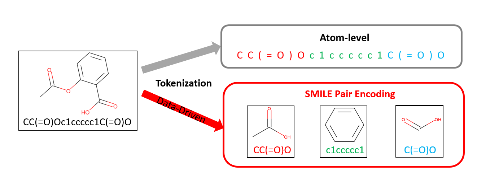

# SMILES Pair Encoding: A Data-Driven Substructure Tokenization Algorithm for Deep Learning
> SMILES Pair Encoding ([JCIM](https://pubs.acs.org/doi/abs/10.1021/acs.jcim.0c01127)) first learns a vocabulary of high frequency SMILES substrings from a large chemical dataset (e.g., ChEMBL) and then tokenizes SMILES based on the learned vocabulary for deep learning models. SMILES Pair Encoding is inspired by [byte-pair-encoding (BPE)](https://www.aclweb.org/anthology/P16-1162/).



## How it works

A SMILES Pair Encoding (SPE) vocabulary is trained with following steps:
- Step 1: Tokenize SMILES from a large dataset (e.g., ChEMBL) at atom-level.
- Step 2: Initialize the vocabulary with all unique tokens.
- Step 3: Iteratively count the occurs of all token pairs in the tokenized SMILES and merge the most frequent occurring token pair as a new token and add it to the vocabulary. This step will stop when one of the conditions is met: (1) A desired vocabulary size is achieved or (2) No pair of tokens has frequency larger than the frequency threshold. The vocabulary size and frequency threshold are hyperparameters for training SMILES pair encoding. 


After training the SPE vocabulary, we can then tokenize SMILES based on the trained vocabulary. The SMILES substrings in the trained vocabulary are ordered by their frequency. During the tokenization process, the SMILES is first tokenized at atom-level. SPE will then iteratively check the frequency of each pairs of tokens and merge the pair of tokens that have the highest frequency count in the trained SPE vocabulary until no further merge operation can be conducted. 


## Installation

```
pip install SmilesPE
```

## Usage Instructions

### Basic Tokenizers

1. Atom-level Tokenizer

```python
from SmilesPE.pretokenizer import atomwise_tokenizer

smi = 'CC[N+](C)(C)Cc1ccccc1Br'
toks = atomwise_tokenizer(smi)
print(toks)
```

    ['C', 'C', '[N+]', '(', 'C', ')', '(', 'C', ')', 'C', 'c', '1', 'c', 'c', 'c', 'c', 'c', '1', 'Br']


2. K-mer Tokenzier

```python
from SmilesPE.pretokenizer import kmer_tokenizer

smi = 'CC[N+](C)(C)Cc1ccccc1Br'
toks = kmer_tokenizer(smi, ngram=4)
print(toks)
```

    ['CC[N+](', 'C[N+](C', '[N+](C)', '(C)(', 'C)(C', ')(C)', '(C)C', 'C)Cc', ')Cc1', 'Cc1c', 'c1cc', '1ccc', 'cccc', 'cccc', 'ccc1', 'cc1Br']


The basic tokenizers are also compatible with [SELFIES](https://github.com/aspuru-guzik-group/selfies) and [DeepSMILES](https://github.com/baoilleach/deepsmiles). Package installations are required.

Example of SELFIES

```python
import selfies
smi = 'CC[N+](C)(C)Cc1ccccc1Br'
sel = selfies.encoder(smi)
print(f'SELFIES string: {sel}')

SELFIES string: [C][C][N+][Branch1_2][epsilon][C][Branch1_3][epsilon][C][C][c][c][c][c][c][c][Ring1][Branch1_1][Br]    
toks = atomwise_tokenizer(sel)
print(toks)

>>> ['[C]', '[C]', '[N+]', '[Branch1_2]', '[epsilon]', '[C]', '[Branch1_3]', '[epsilon]', '[C]', '[C]', '[c]', '[c]', '[c]', '[c]', '[c]', '[c]', '[Ring1]', '[Branch1_1]', '[Br]']

toks = kmer_tokenizer(sel, ngram=4)
print(toks)

>>> ['[C][C][N+][Branch1_2]', '[C][N+][Branch1_2][epsilon]', '[N+][Branch1_2][epsilon][C]', '[Branch1_2][epsilon][C][Branch1_3]', '[epsilon][C][Branch1_3][epsilon]', '[C][Branch1_3][epsilon][C]', '[Branch1_3][epsilon][C][C]', '[epsilon][C][C][c]', '[C][C][c][c]', '[C][c][c][c]', '[c][c][c][c]', '[c][c][c][c]', '[c][c][c][c]', '[c][c][c][Ring1]', '[c][c][Ring1][Branch1_1]', '[c][Ring1][Branch1_1][Br]']
```

Example of DeepSMILES

```python
import deepsmiles
converter = deepsmiles.Converter(rings=True, branches=True)
smi = 'CC[N+](C)(C)Cc1ccccc1Br'
deepsmi = converter.encode(smi)
print(f'DeepSMILES string: {deepsmi}')

>>> DeepSMILES string: CC[N+]C)C)Ccccccc6Br
    
toks = atomwise_tokenizer(deepsmi)
print(toks)

>>> ['C', 'C', '[N+]', 'C', ')', 'C', ')', 'C', 'c', 'c', 'c', 'c', 'c', 'c', '6', 'Br']

toks = kmer_tokenizer(deepsmi, ngram=4)
print(toks)

>>> ['CC[N+]C', 'C[N+]C)', '[N+]C)C', 'C)C)', ')C)C', 'C)Cc', ')Ccc', 'Cccc', 'cccc', 'cccc', 'cccc', 'ccc6', 'cc6Br']
```

### Use the Pre-trained SmilesPE Tokenizer

Dowbload ['SPE_ChEMBL.txt'](https://github.com/XinhaoLi74/SmilesPE/blob/master/SPE_ChEMBL.txt).

```python

import codecs
from SmilesPE.tokenizer import *

spe_vob= codecs.open('../SPE_ChEMBL.txt')
spe = SPE_Tokenizer(spe_vob)

smi = 'CC[N+](C)(C)Cc1ccccc1Br'
spe.tokenize(smi)

>>> 'CC [N+](C) (C)C c1ccccc1 Br'
```

### Pre-trained Models used in the Paper: 
See the donwload links and the instructions in MolPMoFiT [Github](https://github.com/XinhaoLi74/MolPMoFiT)

### Train a SmilesPE Tokenizer with a Custom Dataset

See [train_SPE.ipynb](https://github.com/XinhaoLi74/SmilesPE/blob/master/Examples/train_SPE.ipynb) for an example of training A SPE tokenizer on ChEMBL data.

### Use SPE in Huggingface library
Please see this [colab](https://colab.research.google.com/drive/1tsiTpC4i26QNdRzBHFfXIOFVToE54-9b?usp=sharing) for an example.
